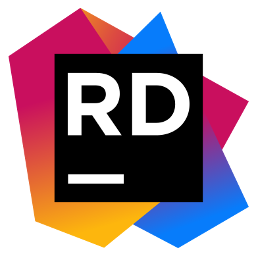
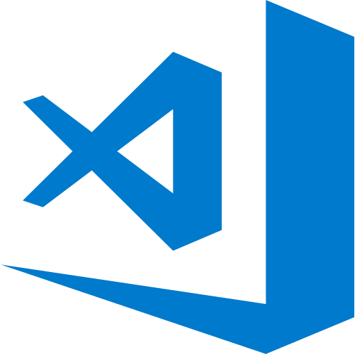

## Hi there, I'm Grigoras Alexandru - aka nuyonu 👋

### Something about me

- 🔭 I’m currently working at [Endava][workingCompany] as a **Senior .NET Developer**   and as a **.NET Trainer** at [Wantsome][wantsomeLink] 
- 🌱 I’m currently learning everything that is new about **.NET Ecosystem** and **.NET 5/6**😊
- 💬 Ask me about anything, I am happy to help
- 👯 I’m looking to collaborate on **.NET projects**
- ⚡ Fun fact: I like to learn and read about anything new in the industry and i really like green color 💚

### Connect with me:
[][linkedin]

 
 

 <em><b>I love connecting with different people</b> so if you want to say <b>hi, I'll be happy to meet you more!</b></em> 

---

### Now i'm working with:

[][linkedin]
[][linkedin]
[][linkedin]
[][linkedin]
[][linkedin]
[][linkedin]
[][linkedin]
[][linkedin]
[][linkedin]
[][linkedin]
[][linkedin]
[][linkedin]
[][linkedin]
[][linkedin]
[][linkedin]
[][linkedin]

---

### I worked with:

[][linkedin]
[][linkedin]
[][linkedin]

---

### Small knowledge about:

[][linkedin]
[][linkedin]
[][linkedin]
[][linkedin]
[][linkedin]
[][linkedin]
[][linkedin]

---

### Stats

[linkedin]: https://www.linkedin.com/in/alexandru-ionel-grigoras-054042115/
[mycinema]: https://github.com/nuyonu/MyCinema
[teask]: https://github.com/nuyonu/TW_TeaSk

[workingCompany]: https://www.endava.com/
[wantsomeLink]: https://wantsome.ro/
